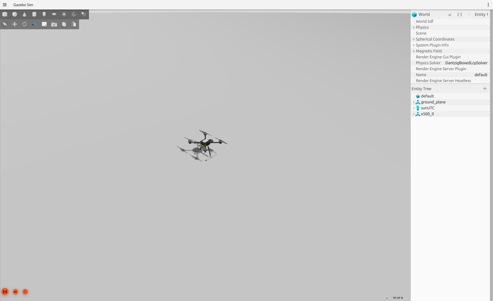
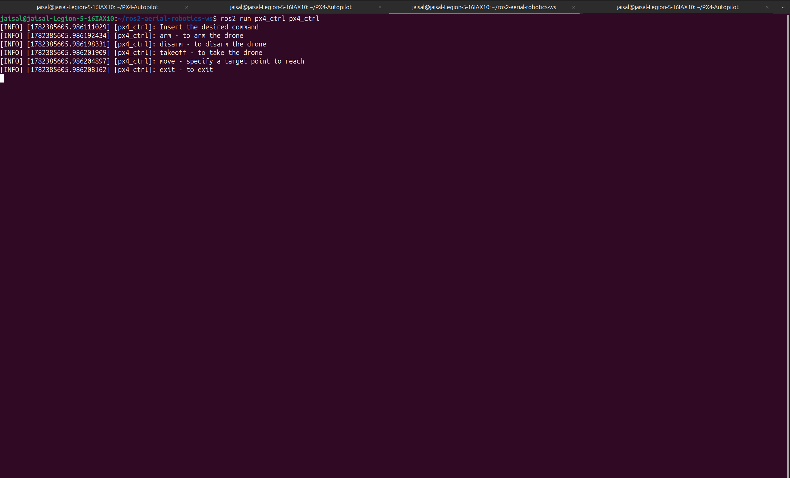
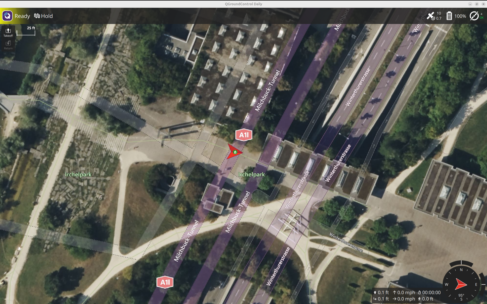
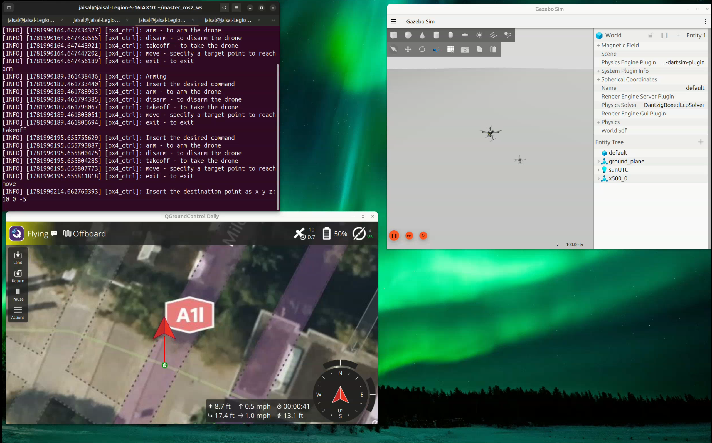

# ROS 2 Aerial Robotics with PX4, Gazebo Sim, and QGroundControl

A complete ROS 2 offboard control system built using **ROS 2 Jazzy**, **PX4 Autopilot**, **Gazebo Sim**, **Micro XRCE-DDS**, and **QGroundControl**.

This project demonstrates how ROS 2 communicates with PX4 through Micro XRCE-DDS to execute autonomous offboard flight operations in simulation, including arming, takeoff, waypoint navigation, and landing.

https://github.com/user-attachments/assets/a2bdb0dd-1ef8-45af-9e91-c96eb75bd08c

---

# Features

- ROS 2 ↔ PX4 integration using Micro XRCE-DDS
- PX4 Software-In-The-Loop (SITL)
- Gazebo Sim quadrotor simulation
- Autonomous Offboard flight control
- Waypoint navigation
- Autonomous takeoff
- Ground Control Station (QGroundControl) integration
- Custom ROS 2 C++ control node

---

# Workspace Packages

| Package    | Description                                                                                   |
| ---------- | --------------------------------------------------------------------------------------------- |
| `px4_ctrl` | Custom ROS 2 node implementing UAV offboard control, waypoint navigation, arming, and takeoff |

---

# Prerequisites

## ROS 2 Jazzy

Install ROS 2 Jazzy before building the workspace.

---

## PX4 Autopilot

Clone and build the PX4 Autopilot repository.

```bash
git clone https://github.com/PX4/PX4-Autopilot.git --recursive

cd PX4-Autopilot

bash Tools/setup/ubuntu.sh
```

---

## Micro XRCE-DDS Agent

Install the DDS bridge used by PX4 and ROS 2.

```bash
git clone https://github.com/eProsima/Micro-XRCE-DDS-Agent.git

cd Micro-XRCE-DDS-Agent

mkdir build
cd build

cmake ..

make

sudo make install

sudo ldconfig
```

---

## PX4 ROS 2 Messages

> **Note:** `px4_msgs` is an external ROS 2 package maintained by the PX4 project and is intentionally **not included** in this repository.

Clone the message package inside the workspace.

```bash
cd src

git clone https://github.com/PX4/px4_msgs.git
```

---

## QGroundControl

- Download the latest **QGroundControl AppImage** before running the project.
- Make the AppImage executable and launch it:

```bash
chmod +x QGroundControl.AppImage

./QGroundControl.AppImage
```

---

# Build

This repository is structured as a ROS 2 workspace. Before building, clone the external `px4_msgs` package into the workspace's `src/` directory.

```bash

source /opt/ros/jazzy/setup.bash

colcon build --symlink-install

source install/setup.bash
```

---

# 1. Launch PX4 SITL and Gazebo

**Terminal 1**

```bash
cd ~/PX4-Autopilot

make px4_sitl gz_x500
```

### Result



---

# 2. Launch the Micro XRCE-DDS Agent

**Terminal 2**

```bash
MicroXRCEAgent udp4 -p 8888
```

The Micro XRCE-DDS Agent bridges PX4 uORB topics with the ROS 2 DDS network.

---

# 3. Launch the ROS 2 Offboard Controller

**Terminal 3**

```bash
source install/setup.bash

ros2 run px4_ctrl px4_ctrl
```

Supported commands:

- `arm`
- `disarm`
- `takeoff`
- `move`
- `exit`

### Result



---

# 4. Connect QGroundControl

**Terminal 4**

Launch **QGroundControl** and verify that the simulated UAV connects successfully.

The Ground Control Station provides:

- Vehicle monitoring
- Flight mode visualization
- Safety management
- Manual landing

### Result



---

# 5. Execute an Autonomous Mission

Example mission:

```text
arm
takeoff
move
```

After entering the `move` command, provide the waypoint coordinates when prompted:

```text
x: 5
y: 0
z: -5
```

The UAV switches to **Offboard Mode** and navigates toward the requested waypoint.

Landing is performed through **QGroundControl** using the **Land** command.

### Result



---

# Technologies Used

- ROS 2 Jazzy
- PX4 Autopilot
- PX4 SITL
- Gazebo Sim
- Micro XRCE-DDS
- QGroundControl
- DDS
- C++
- CMake

---

# Repository Structure

```text
.
├── docs
│   ├── images
│   └── videos
├── src
│   └── px4_ctrl
├── README.md
└── .gitignore
```

---

# System Architecture

```text
                    ROS 2 (px4_ctrl)
                           │
                           ▼
                 Micro XRCE-DDS Agent
                           │
                           ▼
                  PX4 Autopilot (SITL)
                    │              │
                    ▼              ▼
            Gazebo Simulation  QGroundControl
```
